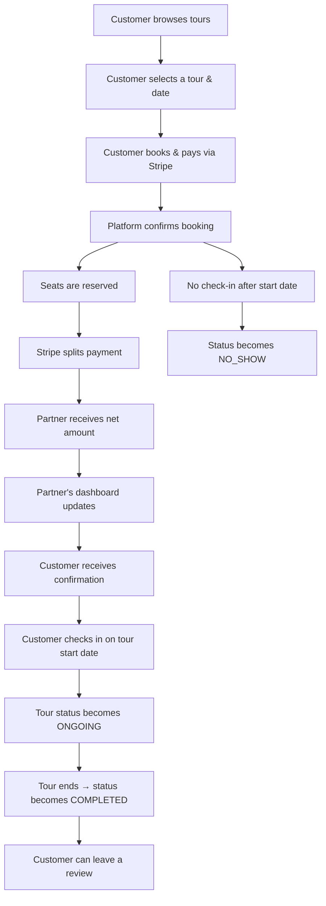

<div align="center">

<p><strong>Modern Tour Booking Platform · Monorepo · Marketplace Architecture</strong></p>

[](https://www.typescriptlang.org/)
[](https://nestjs.com/)
[](https://www.prisma.io/)
[](https://supabase.com/)
[](https://stripe.com/connect)
[](https://turbo.build/)

[](https://nodejs.org/)
[](https://www.npmjs.com/)
[](https://pnpm.io/)
[](https://nodejs.org/api/corepack.html)
[](https://stripe.com/)

</div>

---

## 📖 Overview

**Natours** is a modern tour booking marketplace that connects **tour operators (Partners)** with **travellers (Customers)**. The platform enables partners to list their tours, manage availability, and receive payouts seamlessly — while customers can discover, book, and pay for unforgettable experiences.

This repository is a **monorepo** built with **Turborepo** and **pnpm workspaces**, containing the full-stack application:

- **Customer Experience (CX) Web** – built with Next.js
- **Internal Dashboard** – React Admin dashboard for partners and admins
- **Backend API** – NestJS with Prisma ORM
- **Database** – Supabase PostgreSQL
- **Payments** – Stripe Connect marketplace integration

---

## 🧭 Core Business Model

### The Marketplace

Natours operates as a **two-sided marketplace**:

| Role          | Who They Are                                      | What They Do                                                     |
| ------------- | ------------------------------------------------- | ---------------------------------------------------------------- |
| **Partners**  | Tour operators, local guides, adventure companies | Create tours, set availability, manage bookings, receive payouts |
| **Customers** | Travellers looking for unique experiences         | Browse tours, book experiences, pay securely                     |

### How the Platform Makes Money

The platform charges a **configurable commission (default: 10%)** on every booking. When a customer pays for a tour:

1. The **full payment** is collected by the platform.
2. **Platform commission** is deducted automatically.
3. The **remaining amount** is transferred to the partner's Stripe Connect account.
4. Partners receive payouts directly to their bank account.

This model keeps the platform aligned with partner success — when partners earn more, the platform earns more.

---

## 🔄 Core User Flow



### Detailed Flow

| Step | Actor    | Action                                                                | System Response                                                  |
| :--- | :------- | :-------------------------------------------------------------------- | :--------------------------------------------------------------- |
| 1    | Partner  | Creates a tour with availability rules                                | Tour is published and visible to customers                       |
| 2    | Partner  | Completes Stripe Connect onboarding                                   | Partner can now receive payouts                                  |
| 3    | Customer | Browses tours and selects a date/time                                 | Availability endpoint validates rules & exceptions               |
| 4    | Customer | Books the tour and pays                                               | Booking is created (status: `PENDING`), Stripe session generated |
| 5    | Customer | Completes payment on Stripe                                           | Webhook confirms payment, booking becomes `CONFIRMED`            |
| 6    | Platform | Calculates commission and splits payment                              | `PlatformTransfer` record created                                |
| 7    | Customer | Checks in on the tour start date (via `PATCH /bookings/:id/check-in`) | Booking becomes `ONGOING`                                        |
| 8    | System   | Auto-transition via cron job after tour ends                          | `ONGOING` → `COMPLETED`                                          |
| 9    | System   | Auto-transition via cron job if no check-in after start date          | `CONFIRMED` → `NO_SHOW`                                          |
| 10   | Customer | Leaves a review for the completed tour                                | Review is stored and average rating updated                      |
| 11   | Partner  | Views earnings and transfers in dashboard                             | Partner can see all transactions and feedback                    |

---

### Booking Status Lifecycle

```text
PENDING
   │ (payment confirmed)
   ▼
CONFIRMED
   │ (tour start date/time arrives)
   ├──────────────────────────────────────┐
   │ (customer checks in manually)        │ (no check-in, cron job runs)
   ▼                                      ▼
ONGOING                                 NO_SHOW
   │ (tour end date/time passes)
   ▼
COMPLETED
```

## 🏗️ Architecture

### Monorepo Structure

```text
natours/
├── apps/
│   ├── api/                    # NestJS backend (REST API)
│   │   ├── src/
│   │   │   ├── modules/        # Feature modules
│   │   │   ├── filters/        # Exception filters
│   │   │   └── pipes/          # Validation pipes
│   │   └── package.json
│   └── internal-dashboard/     # React admin dashboard
│       ├── src/
│       ├── public/
│       └── package.json
├── packages/                   # Shared packages (types, utilities)
│   ├── types/                  # Shared TypeScript types
│   └── utils/                  # Shared utilities
├── supabase/                   # Supabase migrations & Edge Functions
│   ├── migrations/             # SQL migrations
│   └── functions/              # Edge Functions
├── package.json                # Root package.json (pnpm workspaces)
├── pnpm-workspace.yaml         # Workspace configuration
├── turbo.json                  # Turborepo pipeline
└── logo.svg                    # Natours logo
```

### Technology Stack

| Layer             | Technology          | Purpose                                                      |
| ----------------- | ------------------- | ------------------------------------------------------------ |
| **API Framework** | NestJS 11           | Backend REST API with dependency injection                   |
| **ORM**           | Prisma 7            | Type-safe database access with native PostgreSQL connections |
| **Database**      | Supabase PostgreSQL | Cloud-hosted PostgreSQL with Auth & Storage                  |
| **Payments**      | Stripe Connect      | Marketplace payment splitting & payouts                      |
| **Auth**          | Supabase Auth (JWT) | User authentication with JWKS (ES256)                        |
| **Frontend**      | Next.js / React     | Customer-facing web experience                               |
| **Admin UI**      | React Admin         | Dashboard for partners & admins                              |
| **Monorepo**      | Turborepo + pnpm    | Fast builds, shared dependencies                             |

### Key Design Decisions

| Decision                                     | Why                                                                                                                                                                                     |
| :------------------------------------------- | :-------------------------------------------------------------------------------------------------------------------------------------------------------------------------------------- |
| **Separate API from Frontend**               | Allows independent scaling, mobile app support, and third-party API access.                                                                                                             |
| **Supabase Auth + NestJS JWT**               | Supabase handles user management; NestJS validates tokens locally (no network call).                                                                                                    |
| **Native PostgreSQL (Prisma) over HTTP API** | Lower latency (~55ms vs ~120ms) for database operations.                                                                                                                                |
| **Stripe Connect**                           | Industry-standard for marketplace payments; handles KYC, onboarding, and payouts.                                                                                                       |
| **RLS Bypass**                               | NestJS uses `service_role` key, bypassing RLS — all authorization logic is in the application layer.                                                                                    |
| **On-demand Tour Schedules**                 | `tour_schedules` are created only when the first booking is made, avoiding database bloat.                                                                                              |
| **Check-in for attendance tracking**         | `CONFIRMED` → `ONGOING` requires manual check-in; auto `NO_SHOW` if no check-in after start date. Provides accurate attendance data and enables post-tour actions (reviews, analytics). |

---

## 🔐 Stripe Connect Marketplace Integration

Natours uses **Stripe Connect Express accounts** to enable seamless payments between customers, partners, and the platform.

### Onboarding Flow

1. **Partner requests onboarding** → `POST /partners/:id/onboarding`
2. **Platform creates Express account** → Stripe Account API
3. **Partner receives onboarding link** → Account Link API
4. **Partner completes onboarding** → Stripe handles KYC + bank account collection
5. **Webhook updates status** → `account.updated` event sets `stripe_onboarding_status = 'active'`

### Payment Splitting Flow

1. **Customer books a tour** → Booking is created (`PENDING`)
2. **Stripe Checkout session created** with:
   - `application_fee_amount` → platform commission (e.g., 10%)
   - `transfer_data.destination` → partner's Stripe Connect account
   - `transfer_group: booking_${id}` → links transfer to booking
3. **Customer pays** → Stripe processes payment
4. **Webhook `checkout.session.completed`**:
   - Confirms booking (`status = CONFIRMED`)
   - Updates payment (`status = SUCCEEDED`)
   - Creates `PlatformTransfer` record (gross, fee, net)
5. **Webhook `transfer.created`**:
   - Updates `stripe_transfer_id` from `'pending'` to the actual transfer ID

### Database Tracking

The `billing.platform_transfers` table tracks every financial transaction:

| Column               | Description                             |
| -------------------- | --------------------------------------- |
| `gross_amount`       | Total amount paid by customer           |
| `platform_fee`       | Commission earned by the platform       |
| `net_amount`         | Amount transferred to the partner       |
| `stripe_transfer_id` | Stripe transfer ID (for reconciliation) |
| `status`             | `PENDING` / `SUCCEEDED` / `FAILED`      |

---

## 🗄️ Database Schema

### Core Tables

| Schema    | Table                     | Purpose                                                                                                               |
| --------- | ------------------------- | --------------------------------------------------------------------------------------------------------------------- |
| `tour`    | `partners`                | Tour operators / companies                                                                                            |
| `tour`    | `tours`                   | Tour listings (name, price, difficulty, description)                                                                  |
| `tour`    | `availability_rules`      | Recurring availability (days of week, date range, start time)                                                         |
| `tour`    | `availability_exceptions` | Blackout dates (overrides rules)                                                                                      |
| `tour`    | `tour_schedules`          | Created on-demand (seats available per departure)                                                                     |
| `tour`    | `bookings`                | Customer reservations with status (`PENDING`, `CONFIRMED`, `ONGOING`, `COMPLETED`, `CANCELLED`, `EXPIRED`, `NO_SHOW`) |
| `tour`    | `reviews`                 | Customer reviews and ratings                                                                                          |
| `account` | `profiles`                | User profiles with roles (`CUSTOMER`, `GUIDE`, `PARTNER_ADMIN`, `ADMIN`)                                              |
| `billing` | `payments`                | Payment records (Stripe session ID, status)                                                                           |
| `billing` | `platform_transfers`      | Financial tracking for Stripe Connect splits                                                                          |
| `billing` | `stripe_webhook_events`   | Idempotency tracking for webhooks                                                                                     |

### Enums

| Enum              | Values                                                                            |
| ----------------- | --------------------------------------------------------------------------------- |
| `app_role`        | `CUSTOMER`, `GUIDE`, `LEAD_GUIDE`, `ADMIN`, `PARTNER_ADMIN`                       |
| `booking_status`  | `PENDING`, `CONFIRMED`, `ONGOING`, `COMPLETED`, `CANCELLED`, `EXPIRED`, `NO_SHOW` |
| `tour_difficulty` | `EASY`, `MEDIUM`, `DIFFICULT`                                                     |
| `tour_status`     | `COMING_SOON`, `DRAFT`, `LIVE`                                                    |
| `TransferStatus`  | `PENDING`, `SUCCEEDED`, `FAILED`                                                  |

---

## 🚀 Getting Started (Development)

### Prerequisites

- **NixOS** (recommended) – the project uses a Nix shell for reproducible tooling
- Or any Linux/macOS with `pnpm`, `Node.js 24+`, `Docker` (for Supabase local)

### Quick Start

```bash
# Clone the repository
git clone https://github.com/AndreWicaksono/natours.git
cd natours

# Enter the Nix development shell (if using NixOS)
nix develop ~/nix-config#natours

# Install dependencies
pnpm install

# Start the development server
pnpm turbo dev
```

### Environment Variables

Create `apps/api/.env` with:

```bash
# Database
DATABASE_URL="postgresql://postgres:[PASSWORD]@[HOST]:6543/postgres"

# Supabase
SUPABASE_URL="https://[PROJECT_REF].supabase.co"
SUPABASE_SERVICE_ROLE_KEY="eyJhbGc..."

# Stripe (test mode)
STRIPE_SECRET_KEY="sk_test_..."
STRIPE_WEBHOOK_SIGNING_SECRET="whsec_..."
STRIPE_RESTRICTED_API_KEY="rk_test_..."

# Application
PLATFORM_FEE_PERCENTAGE=10
APP_URL="http://localhost:3000"
NODE_ENV="development"
```

### Setting Up the Database

```bash
# Run Supabase migrations locally
supabase start

# Generate Prisma client
pnpm turbo run prisma:generate

# Push schema to database
pnpm -F api run prisma:push
```

---

## 🗄️ Database Migration

### Standard Workflow (Recommended)

For most schema changes, use Prisma's migration system:

```bash
# 1. Update schema.prisma with your changes
# 2. Generate and apply the migration locally
cd apps/api
npx prisma migrate dev --name describe_your_change

# 3. Verify the migration
npx prisma migrate status

# 4. Commit the migration file
git add prisma/migrations/
git commit -m "feat(db): add describe_your_change migration"

# 5. Apply to production (deployment)
npx prisma migrate deploy
```

### Troubleshooting: When a Migration Doesn't Update the Table

Sometimes, `prisma migrate dev` fails due to schema drift or mismatched migration history. This is common when:

- You used `prisma db pull` to introspect an existing database.
- The baseline migration (`0_baseline`) contains unsupported SQL (e.g., column references in `DEFAULT` expressions).
- Prisma's shadow database fails to apply the baseline migration.

**Solution 1: Use `prisma db push` (for prototyping)**

```bash
# This applies schema changes directly without creating migration files
# Use this for development only – never in production.
npx prisma db push
```

**Solution 2: Manually create a migration using `migrate diff` (for production)**

```bash
# 1. Create a migration directory
mkdir -p prisma/migrations/1_add_your_change

# 2. Generate SQL for the changes
npx prisma migrate diff \
  --from-config-datasource \
  --to-schema prisma/schema.prisma \
  --script > prisma/migrations/1_add_your_change/migration.sql

# 3. Review and edit the SQL file
# (Remove any unwanted changes, especially to auth schema)

# 4. Mark the migration as applied
npx prisma migrate resolve --applied 1_add_your_change

# 5. Verify
npx prisma migrate status
```

**Solution 3: Raw SQL (last resort)**

When Prisma migrations are blocked and you need to apply a critical change:

```sql
-- Example: Add an enum and update a column (our TransferStatus case)
CREATE TYPE billing."TransferStatus" AS ENUM ('PENDING', 'SUCCEEDED', 'FAILED');

ALTER TABLE billing.platform_transfers
ALTER COLUMN status SET DATA TYPE billing."TransferStatus"
USING status::billing."TransferStatus";
```

After running raw SQL, **mark the migration as applied**:

```bash
npx prisma migrate resolve --applied 1_add_transfer_status
```

### Migration Best Practices

| Scenario                            | Command                                  | When to Use                               |
| ----------------------------------- | ---------------------------------------- | ----------------------------------------- |
| **New schema change**               | `prisma migrate dev --name change`       | Every time you modify `schema.prisma`     |
| **Baseline from existing database** | `prisma db pull` → `prisma migrate diff` | Initial setup only                        |
| **Quick development sync**          | `prisma db push`                         | Local development only (never production) |
| **Manual fix**                      | Raw SQL + `prisma migrate resolve`       | When migrations are blocked               |
| **Production deployment**           | `prisma migrate deploy`                  | CI/CD pipeline                            |

### Common Migration Errors & Fixes

| Error                                                 | Cause                                           | Fix                                                        |
| ----------------------------------------------------- | ----------------------------------------------- | ---------------------------------------------------------- |
| `P3006: Migration failed to apply`                    | Baseline migration has unsupported SQL          | Use `prisma migrate diff` + `resolve --applied`            |
| `P3017: Migration could not be found`                 | Migration directory missing                     | Ensure the migration folder exists in `prisma/migrations/` |
| `P3018: Failed to apply migration to shadow database` | Shadow database issue                           | Try `prisma migrate reset` (development only)              |
| `Drift detected`                                      | Database schema doesn't match migration history | Use `prisma db push` (dev) or create a new migration       |

---

## 📚 API Documentation

### Base URL

- **Development**: `http://localhost:3000/api`
- **Production**: _Not available yet_

### Key Endpoints

#### Tours

- `GET /tours` – List all tours
- `POST /tours` – Create a new tour (partner only)
- `GET /tours/:id` – Get tour details
- `PUT /tours/:id` – Update tour (partner only)

#### Bookings

- `GET /bookings` – List user's bookings
- `POST /bookings` – Create a new booking
- `GET /bookings/:id` – Get booking details
- `PATCH /bookings/:id/cancel` – Cancel a booking
- `PATCH /bookings/:id/check-in` – Check in for a tour (customer only, requires `CONFIRMED` status)

#### Payments

- `POST /payments/checkout` – Initiate payment
- `GET /payments/:id` – Get payment status

#### Partners

- `POST /partners/:id/onboarding` – Start Stripe onboarding
- `GET /partners/:id/earnings` – View earnings summary

---

## 🧪 Testing

```bash
# Run unit tests
pnpm test

# Run tests in watch mode
pnpm test:watch

# Run end-to-end tests
pnpm test:e2e

# Generate coverage report
pnpm test:coverage
```

---

## 🔐 Security Considerations

### Authentication & Authorization

- **JWT Tokens**: Issued by Supabase, validated by NestJS
- **Role-Based Access Control (RBAC)**: Enforced at the endpoint level
- **Webhook Verification**: All Stripe webhooks are cryptographically signed

### Data Protection

- **HTTPS Only**: All API calls use TLS 1.3
- **Rate Limiting**: 100 requests per minute per IP
- **SQL Injection Protection**: Prisma parameterized queries
- **CORS**: Restricted to trusted domains

---

## 📊 Partner Dashboard

The partner dashboard (available in the Internal Dashboard app) provides:

- **Tour Management** – Create, edit, publish, and archive tours
- **Booking Overview** – Real-time booking status and customer details (including `ONGOING`, `COMPLETED`, and `NO_SHOW` statuses)
- **Availability Management** – Set recurring rules and blackout dates
- **Financial Insights** – Earnings, pending payouts, and transaction history
- **Reviews & Ratings** – Customer feedback and average ratings

---

## 🤝 Contributing

This project is managed as a monorepo. Please follow the existing code style and ensure all tests pass before submitting a pull request.

### Development Workflow

1. Create a feature branch: `git checkout -b feat/feature-name`
2. Make your changes and commit: `git commit -m "feat: add feature"`
3. Push to GitHub: `git push origin feat/feature-name`
4. Open a pull request

### Code Style

- **Linting**: `pnpm turbo run lint`
- **Formatting**: `pnpm turbo run format`

---

## 🚢 Deployment

### Production Deployment

1. Push to `main` branch
2. GitHub Actions CI/CD pipeline runs tests
3. Deploy to Vercel (frontend) and Railway/Render (API)

---

## 🐛 Troubleshooting

### Common Issues

**Issue**: Prisma client not generated

```bash
pnpm turbo run prisma:generate
```

**Issue**: Stripe webhooks not received

```bash
# Check webhook signing secret in .env
stripe listen --forward-to http://localhost:3000/webhooks/stripe
```

**Issue**: Supabase connection timeout

```bash
# Restart Supabase
supabase stop && supabase start
```

---

## 📄 License

MIT © Andre Wicaksono

---

## 👨‍💻 Author

**Andre Wicaksono**

_Software Engineer · Nix Enthusiast_

- **GitHub**: [@AndreWicaksono](https://github.com/AndreWicaksono)
- **LinkedIn**: [linkedin.com/in/andrewicaksono](https://linkedin.com/in/andrewicaksono)
- **Email**: [andrewicaksana@gmail.com](mailto:andrewicaksana@gmail.com)

---

**Last Updated**: September 7, 2026
